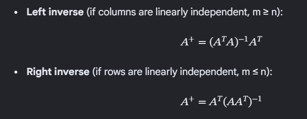

## Underwater fins mapping

### Context

We are almost done modifying ArduPlane for underwater torpedo-shaped AUVs.

After the controllers compute required virtual aileron, elevator and rudder deflections, these commands need to be translated into the corresponding fin deflections for the underwater vehicle.

There are multiple common fin configurations: 
- Plus-fin
- X-fin
- Plus-fin with canards
- X-fin with canards
- Custom (sometimes as a result of fin failures or specific design requirements)

### Thinking

- Each config has a Control Effectiveness matrix (3 x N) whichs maps the roll, pitch, yaw contribution to each of the N fins at a given angle deflection.
- The fin deflections can then be computed by inverting this matrix and multiplying it with the desired roll, pitch, and yaw commands.
- Use Moore-Penrose pseudoinverse if the Control Effectiveness matrix is not square or not directly invertible. This step is only done once and the inverse is cached whenever setting up a config at Plane initialization.
- In the future, when there is a fin failure or a change in the fin configuration, the Control Effectiveness matrix can be updated and the pseudoinverse recalculated to adapt to the new setup.
- Use two different variants of Moore-Penrose depending on how many fins still active:

### Implementation

1. Write a [FinsMixing](../ArduPlane/fins_mixing.h) class:
   - Store the Control Effectiveness (abbrev `_control_eff_mat`) matrix and its pseudoinverse (abbrev `_control_alloc_mat`).
   - Enum called `torp_fins_config` containing names of common configs above. Have method `setup_fins(torp_fins_config config)` which assigns `_control_eff_mat` (3 x N), and then calls `_compute_control_alloc_mat()`.
   - You just need to do the default for the simple Plus-fin config, the rest leaves placeholder for me, don't need to think about them for now.
   - Have a method to take in the desired roll, pitch, and yaw commands and either return the corresponding (N x 1) fin deflections or apply them directly to the fins. Up to you how to implement this.
   - Method called `disable_fin(int fin_index)` to disable a specific fin by its index (failure handling). It will reassign `_control_eff_mat` (3 x (N-1)) and then call `_compute_control_alloc_mat()` to update the pseudoinverse.
   - Params: `CONFIG`, `RLL_FT` (the roll factor in each of the column of control effectivenss), `C_RLL_FT` and `C_PIT_FT` (the roll and pitch factor of the canards in the matrix, used when canards are present).

2. Usage in Plane class:
   - Instantiate the `FinsMixing` class and call `setup_fins(config)` in existing `Plane::init_ardupilot()` method.
   - Call the method to compute the fin deflections in existing `Plane::servos_output()`.
   - The `SERVOx_FUNCTION` params for the fins will be assigned Script_1 to Script_6 (94 to 99). I am not sure how to push the pwm to them without lua, you may need to investigate that.
   - We dont use `disable_fin(int fin_index)` for now.

### Q&A

1. Example control effectiveness matrix, looking from back to front:

Plus fin (1: top, 2: right, 3: bottom, 4: left):
      Fin 1      Fin 2      Fin 3     Fin 4
R   [ RLL_FT     RLL_FT     RLL_FT    RLL_FT    ]
P   [ 0          1          0         -1        ]
Y   [ -1         0          1         0         ]

X fin (1: top right, 2: bottom right, 3: bottom left, 4: top left):
      Fin 1      Fin 2      Fin 3     Fin 4
R   [ RLL_FT     RLL_FT     RLL_FT    RLL_FT    ]
P   [ 0.707      0.707      -0.707    -0.707    ]
Y   [ -0.707     0.707      0.707     -0.707    ]

Ignore default for configs with canards for now.

2. Parameter:

- Should group under a `FINS_` prefix and registered as AP_Group.
- Config: 0 for plus, 1 for X, 2 for plus with canards, 3 for x with canards, 4 for custom.

3. Disable traditional aircraft mixers